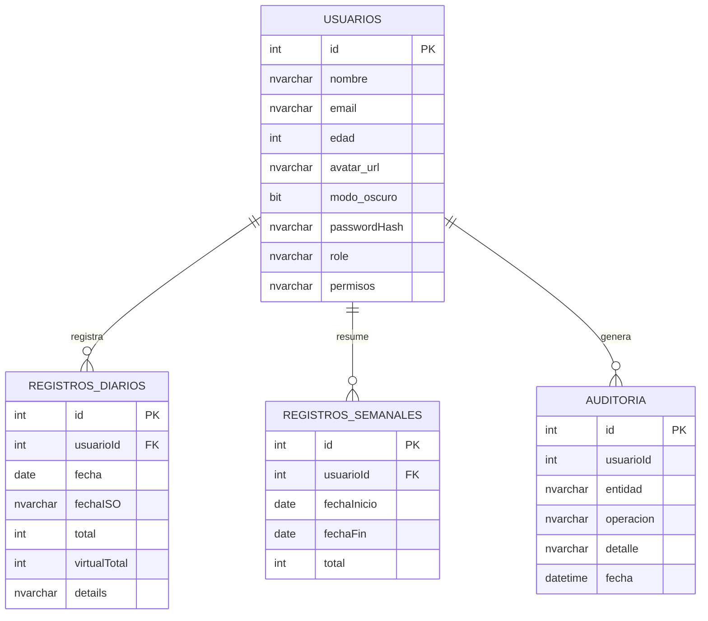

# Recursos Azure SQL - Proyecto Integrador H2O

**Fecha de revisión:** Febrero 2026  
**Suscripción:** Azure for Students

---

## 0. Nuevo grupo de recursos H2O Integrador (2026-02-11)

| Recurso | Valor |
|---------|-------|
| **Grupo** | rg-h2o-integrador |
| **Región** | canadacentral |
| **Servidor SQL** | sql-h2o-integrador-lf |
| **Base de datos** | h2o-db (Basic) |
| **Usuario admin** | sqladmin |
| **FQDN** | sql-h2o-integrador-lf.database.windows.net |

**Backend:** `backend/` - Express + TypeORM + mssql (Azure SQL)

---

## 1. Resumen de recursos existentes (Puce-DB)

### Suscripción
| Campo | Valor |
|-------|-------|
| **Nombre** | Azure for Students |
| **ID** | 81197ad3-7966-494e-a2b3-c6a5457b3cc4 |
| **Crédito** | $100 USD por 12 meses |

### Grupos de recursos
- `rg-sentinel-recycle` (canadacentral)
- `Puce-DB` (canadacentral) ← **Contiene el servidor SQL**
- `Automation_Project` (canadacentral)

---

## 2. Servidor Azure SQL

| Campo | Valor |
|-------|-------|
| **Nombre** | puce-bdd-server-lf |
| **Grupo de recursos** | Puce-DB |
| **Región** | canadacentral |
| **FQDN** | puce-bdd-server-lf.database.windows.net |
| **Administrador** | FalconLD |
| **Estado** | Ready |

Este servidor fue creado durante las clases de Bases de Datos en la PUCE.

---

## 3. Bases de datos existentes

| Base de datos | SKU | Estado | Uso recomendado |
|---------------|-----|--------|-----------------|
| `master` | GP_SYSTEM | Online | Sistema (no usar) |
| `puce-bdd` | GP_S_Gen5_2 | **Pausada** | Clase anterior |
| `puce-bdd-prueba-lf` | GP_S_Gen5_2 | **Pausada** | Pruebas de clase |

### Sobre las bases pausadas
- **Cuando están pausadas:** solo consumen almacenamiento (coste mínimo).
- **Cuando se reanudan:** vuelven a consumir créditos por proceso.
- Por eso tus ejercicios de clase no generaron costos evidentes: las bases pasaron mucho tiempo pausadas.

---

## 4. Reglas de firewall

Tu IP actual (**45.162.74.4**) ya está permitida con la regla **"Home"**.

Otras reglas: PUCE, Colab, máquinas del taller, etc.

---

## 5. Opciones para el Proyecto Integrador H2O

### Opción A: Usar una base existente (recomendada)
1. Reanudar `puce-bdd-prueba-lf` o `puce-bdd` desde Azure Portal.
2. Crear en ella las tablas del proyecto H2O.
3. Al terminar, pausar de nuevo para reducir coste.

### Opción B: Crear una base nueva
1. Crear una base nueva `h2o-integrador` en el servidor `puce-bdd-server-lf`.
2. Usar tier **Basic** para menor coste (~$5/mes).

---

## 6. Cadena de conexión

Formato (reemplaza `[PASSWORD]` con tu contraseña real):

```
Server=tcp:puce-bdd-server-lf.database.windows.net,1433;Initial Catalog=puce-bdd-prueba-lf;Persist Security Info=False;User ID=FalconLD;Password=[PASSWORD];MultipleActiveResultSets=False;Encrypt=True;TrustServerCertificate=False;Connection Timeout=30;
```

Para Node.js / TypeORM (formato ADO.NET adaptado):
```
Server=puce-bdd-server-lf.database.windows.net;Database=puce-bdd-prueba-lf;User Id=FalconLD;Password=[PASSWORD];Encrypt=true;
```

---

## 7. Comandos útiles (Azure CLI)

### Reanudar una base pausada
```bash
az sql db resume --resource-group Puce-DB --server puce-bdd-server-lf --name puce-bdd-prueba-lf
```

### Pausar una base (para ahorrar créditos)
```bash
az sql db pause --resource-group Puce-DB --server puce-bdd-server-lf --name puce-bdd-prueba-lf
```

### Crear una base nueva (tier Basic)
```bash
az sql db create `
  --resource-group Puce-DB `
  --server puce-bdd-server-lf `
  --name h2o-integrador `
  --service-objective Basic
```

### Agregar regla de firewall (si cambias de red)
```bash
az sql server firewall-rule create `
  --resource-group Puce-DB `
  --server puce-bdd-server-lf `
  --name MiNuevaIP `
  --start-ip-address TU_IP `
  --end-ip-address TU_IP
```

---

## 8. Sobre los créditos (Azure for Students)

- **$100 USD** durante 12 meses.
- Todo lo que uses se descuenta de ese crédito.
- No hay servicio SQL “gratuito ilimitado”, pero:
  - Las bases **pausadas** gastan muy poco.
  - Puedes consultar el saldo en: [Azure Sponsorships portal](https://www.microsoftazuresponsorships.com/).

---

## 9. Próximos pasos sugeridos

1. Reanudar `puce-bdd-prueba-lf` (o elegir otra base).
2. Definir y crear el modelo de datos (tablas) del proyecto H2O.
3. Configurar el backend (Express + TypeORM) con la cadena de conexión.
4. Cuando no la uses, pausar la base para conservar créditos.

---

## 10. Plan de políticas de seguridad

Este plan resume las políticas que se aplican (o se deben aplicar) en la infraestructura de H2O:

### 10.1 Plataforma e infraestructura

- **Sistema e infraestructura**:
  - Backend desplegado sobre entorno Node.js (Windows / Azure) consumiendo **Azure SQL Database** en `canadacentral`.
  - Base de datos `h2o-db` en el servidor `sql-h2o-integrador-lf.database.windows.net` dentro del grupo `rg-h2o-integrador`.
- **Aislamiento y acceso**:
  - Acceso a SQL restringido por **firewall de servidor** (solo IPs conocidas del equipo y, opcionalmente, Azure Services).

### 10.2 Control de acceso y credenciales

- **Principio de mínimo privilegio**:
  - La API debe usar una **cuenta de aplicación** con permisos limitados (`db_datareader`, `db_datawriter`) y no la cuenta `sqladmin` para operaciones diarias.
- **Gestión de secretos**:
  - Credenciales almacenadas en `.env` (`backend/.env`) y excluidas del repositorio (`.gitignore`).
  - Recomendado: migrar a **Azure Key Vault** en un despliegue productivo.

### 10.3 Cifrado, red y transporte

- **Conexión cifrada**:
  - Siempre con `Encrypt=True` y `TrustServerCertificate=False` (ya configurado en `backend/src/config/database.js`).
- **Tráfico mínimo expuesto**:
  - Solo se exponen los puertos necesarios para la API; el acceso directo a SQL se limita a administradores.

### 10.4 Integridad y validación de datos

- **Restricciones en BD**:
  - `CHECK` en `usuarios.edad` y `registros_diarios.total` para evitar edades inválidas o consumos negativos (ver `backend/sql/h2o_extras.sql`).
  - `UNIQUE` en `usuarios.email` para evitar duplicados.
- **Reglas de negocio en servidor**:
  - Stored procedures como `sp_InsertRegistroSeguroH2O` validan existencia de usuario y rango de valores, ahora usando **transacciones explícitas** para garantizar consistencia.

### 10.5 Auditoría y monitoreo

- **Auditoría de operaciones**:
  - Tabla `auditoria` en Azure SQL para registrar operaciones críticas (INSERT/DELETE de registros, cambios de usuario).
  - Trigger `trg_registros_diarios_auditoria` para registrar inserciones/eliminaciones sensibles en `registros_diarios`.
  - Auditoría adicional desde la API en controladores como `registrosController` y `usuariosController`.
- **Monitoreo operativo**:
  - Revisión periódica de la tabla `auditoria` y del panel admin para detectar comportamientos anómalos.

### 10.6 Copias de seguridad y recuperación

- **Backups automáticos**:
  - Azure SQL realiza **copias de seguridad automáticas** de `h2o-db` (configurables en el portal).
- **Estrategia recomendada**:
  - Verificar periódicamente el estado de backups y el período de retención.
  - Documentar el procedimiento de restauración (base point-in-time) y probarlo al menos una vez durante el ciclo del proyecto.

### 10.7 Buenas prácticas adicionales

- Mantener el backend y dependencias actualizados (`npm outdated`/`npm audit`).
- Revisar periódicamente los permisos de las cuentas que acceden al servidor SQL.
- Mantener revisiones de código y controles de acceso al repositorio (GitHub).

---

## 11. Justificación técnica del diseño de bases de datos

### 11.1 Elección de Azure SQL como base transaccional principal

Para el núcleo del proyecto (usuarios, registros diarios/semanales, auditoría) se eligió **Azure SQL Database** como motor relacional transaccional porque:

- **Consistencia e integridad fuertes**  
  - Soporta claves primarias/foráneas, `CHECK`, `UNIQUE`, `DEFAULT` y **transacciones ACID**, lo que es crítico para no perder ni duplicar registros de consumo de agua.
- **Soporte nativo para lógica en BD**  
  - Permite implementar **stored procedures** y **triggers**, que usamos para:
    - Validar reglas de negocio (por ejemplo, `sp_InsertRegistroSeguroH2O`).
    - Registrar auditoría sensible (`trg_registros_diarios_auditoria` y tabla `auditoria`).
- **Escalabilidad administrada**  
  - Azure se encarga de backups automáticos, alta disponibilidad y escalado del servicio; el equipo se enfoca en la lógica del proyecto y no en administración de servidores.
- **Integración con el stack visto en clases**  
  - El backend (`backend/`) usa **Express + TypeORM + mssql**, exactamente como en la clase `10.Clase_express_typeorm_postgres.html` (adaptado a Azure SQL), facilitando el aprendizaje y la trazabilidad entre clase y proyecto.

En resumen, Azure SQL es la mejor opción para la parte **OLTP** (transaccional) donde se requiere integridad, seguridad y capacidad de análisis mediante SQL estándar.

### 11.2 Uso complementario de MongoDB

Adicionalmente se utiliza **MongoDB** (`MONGODB_URI` en `.env` y modelos como `RankingEntry`) para ciertos escenarios donde:

- Se requiere **esquema flexible** para almacenar documentos de ranking o rachas sin afectar el modelo transaccional de Azure SQL.
- El patrón de acceso es principalmente de **lectura** (consultar rankings agregados) y tolera cierta eventualidad.
- Se quiere demostrar el uso de una **base NoSQL** complementaria, alineado a los contenidos de Bases de Datos II y la clase `13.Clase_express_mongodb.html`.

De esta forma:

- **Azure SQL** se encarga del dato crítico y persistente (usuarios, registros diarios, auditoría, reportes).
- **MongoDB** se usa para **analítica ligera** y datos agregados (ranking histórico), sin poner en riesgo la consistencia del núcleo transaccional.

### 11.3 Relación con requerimientos funcionales y no funcionales

- **Funcionales**:
  - Registrar y consultar consumos diarios/semanales por usuario.
  - Calcular promedios, rankings y métricas globales (panel admin).
  - Gestionar roles y permisos para un panel de administración.
- **No funcionales**:
  - **Seguridad**: conexión cifrada, auditoría, validaciones en BD, hashing de contraseñas (`passwordHash` en `usuarios`).
  - **Escalabilidad y disponibilidad**: servicio PaaS administrado (Azure SQL), con opción de escalar verticalmente según carga.
  - **Mantenibilidad**: modelo relacional bien definido con entidades TypeORM (`backend/src/models/*.js`), acoplado a un ORM estándar.

---

## 12. Modelo de datos (diagrama ER)

El modelo de datos relacional implementado en Azure SQL se refleja tanto en las entidades TypeORM (`backend/src/models/*.js`) como en las tablas del servidor `sql-h2o-integrador-lf`.  
Las entidades principales son:

- `usuarios`: información de perfil, credenciales y permisos.
- `registros_diarios`: consumos diarios de agua por usuario.
- `registros_semanales`: agregados semanales (para análisis de tendencias).
- `auditoria`: operaciones sensibles registradas (INSERT/DELETE, cambios relevantes).
- `rachas` / `ranking` (en combinación con MongoDB) para métricas avanzadas.

Un posible diagrama ER simplificado es:



Este diagrama puede exportarse como imagen (por ejemplo desde VS Code o un editor de Markdown con soporte Mermaid) e incluirse en la documentación formal del proyecto (Confluence o informe en PDF), cumpliendo así el requisito de la rúbrica respecto al **modelo de datos y sus claves/relaciones**.

